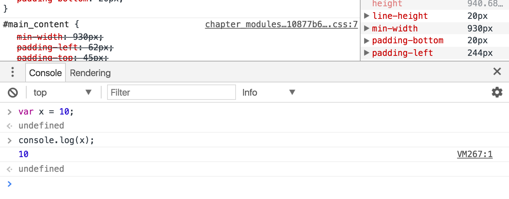

# Running JavaScript

To be able to learn JavaScript, first we need to be able to run JavaScript. JS is an interpreted language, meaning it needs an interpreter to parse through our code and turn it into actions for the computer. As a client-facing scripting language, JavaScript is most comfortable running in a browser. You can do this one of three ways.

## Online Interpreters

If you need to write and test just a few lines of JS, an online interpreter can be a good option. [JSFiddle](https://jsfiddle.net/), [jsbin](http://jsbin.com/?js,console), and [CodePen](http://codepen.io/) are a few
    examples. These can be great for algorithm challenges!


Every online interpreter will have its own interface, just make sure you have an area to write code and a console to read outputs.

### Browser Console

We can also run JS right out of the browser console. This can be useful for debugging, however it will only interpret JS one input at a time, rather than running an entire file.



This is also where we will read the majority of our console messages.

### .html

**We recommend writing .html files and including your JavaScript in a script tag.** You will need to do this to complete some of the assignments in the JavaScript chapter, and it's the best representation of how client side JavaScript actually performs. This is also the JavaScript you are already familiar with!

``` html
<html>
<head>
  <script>
        var x = 10;
        console.log(x);
    </script>  
</head>
<body>
</body>
</html>
```

Remember to always have your browser console open so you can see the outputs!

NEXT: [ECMAScript & ES6](./es6.md)
